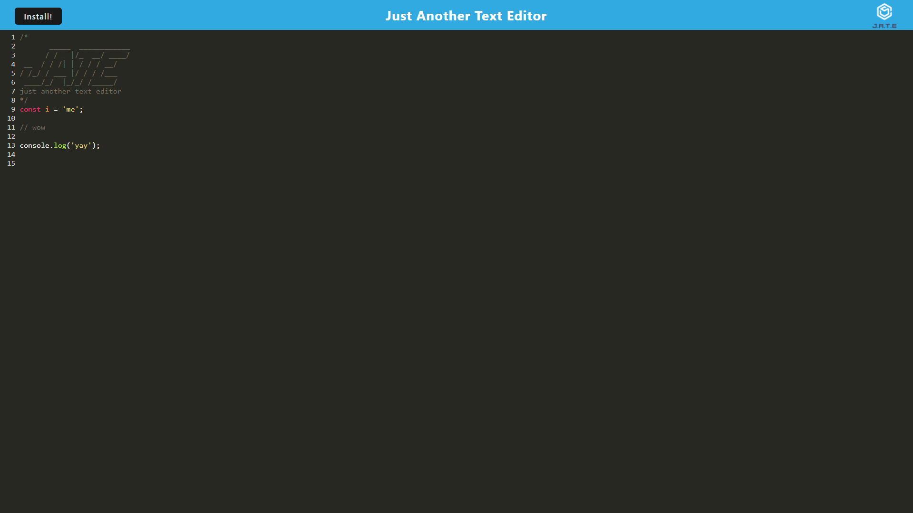

# JATE - Just Another Text Editor

## Link to JATE
https://jate-code-9aec63e172ae.herokuapp.com/

## Description
I wated to create a note or code text editor that I can populate, access, and use with or without an internet connection! I can retrieve the information whether I'm live or not. I wanted to be able to install the application and use it regardless of internet connection, and also knowing my notes and code will be there waiting for me when I exit and come back.

## Table of contents
- [Installation](#installation)
- [Usage](#usage)
- [License](#license)
- [Contribution](#contribution)
- [Tests](#tests)
- [Questions](#questions)
 

## Installation
N/A

## Usage
Simply open the site, and click inside the box and begin typing your code or notes! Once you're done, you can simply exit the site. If you want to access the notes again, just go back to the site using the same browser and your info is saved! You can also install the app by pressing on the install button. Now, if you're using chrome for example, you can access the app by visiting chrome://apps , and you'll find JATE waiting for you! You can use the app online or offline, and it will save your text just the same.  

## License
MIT License https://opensource.org/licenses/MIT

    Copyright (c) 2023 zeinahares
    
    Permission is hereby granted, free of charge, to any person obtaining a copy of this software and associated documentation files (the "Software"), to deal in the Software without restriction, including without limitation the rights to use, copy, modify, merge, publish, distribute, sublicense, and/or sell copies of the Software, and to permit persons to whom the Software is furnished to do so, subject to the following conditions:
    
    The above copyright notice and this permission notice shall be included in all copies or substantial portions of the Software.
    
    THE SOFTWARE IS PROVIDED "AS IS", WITHOUT WARRANTY OF ANY KIND, EXPRESS OR IMPLIED, INCLUDING BUT NOT LIMITED TO THE WARRANTIES OF MERCHANTABILITY, FITNESS FOR A PARTICULAR PURPOSE AND NONINFRINGEMENT. IN NO EVENT SHALL THE AUTHORS OR COPYRIGHT HOLDERS BE LIABLE FOR ANY CLAIM, DAMAGES OR OTHER LIABILITY, WHETHER IN AN ACTION OF CONTRACT, TORT OR OTHERWISE, ARISING FROM, OUT OF OR IN CONNECTION WITH THE SOFTWARE OR THE USE OR OTHER DEALINGS IN THE SOFTWARE.

## Contribution
N/A 

## Tests
N/A 
## Questions - 
  
Feel free to reach me for questions at anytime!

  GitHub URL: https://github.com/zeinahares 

  Email Address: zeinahares@gmail.com 
